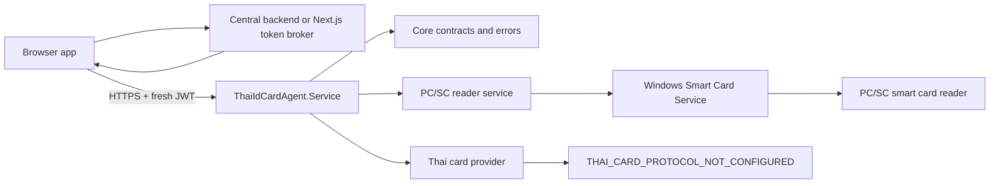

# ThaiIdCardAgent

ThaiIdCardAgent is a local Windows loopback agent for PC/SC smart card readers. It exposes an authenticated ASP.NET Core Minimal API for authorized web applications and keeps browser code away from USB/PCSC access.



## Current Status

Production Acceptance passed on the test machine with `ThaiIdCardAgent` installed as a Windows Service running under `NT AUTHORITY\LocalService`.

Validated through the installed service:

- HTTPS health on `https://localhost:18443` without certificate-validation bypass.
- JWT authentication and short-lived JWT issue.
- Readers API.
- Card status API.
- Card ATR API.
- PC/SC access under `NT AUTHORITY\LocalService`.
- CardRemoved and CardInserted via status polling with 2 consecutive observations.
- SSE `CardRemoved` and `CardInserted` through `/api/v1/events` under Windows Service with real hardware.
- SSE disconnect and reconnect repeated rounds.
- Windows reboot and Automatic Delayed Start.
- Restart service health/readers.
- Upgrade, uninstall while keeping config/logs, reinstall, and certificate retention.

Still incomplete:

- Code signing. Published binaries are currently unsigned.
- Thai ID personal-data reading. `POST /api/v1/card/read` returns `THAI_CARD_PROTOCOL_NOT_CONFIGURED`.
- Phase 10 browser pilot acceptance for `examples/nextjs-client` must still be run with the installed service and real hardware before committing the web integration as pilot-ready.

No Citizen ID, owner name, address, birth date, or photo has been read or documented.

## Prerequisites

- Windows x64
- .NET SDK `10.0.302` or compatible .NET 10 SDK
- Windows Smart Card Service
- PC/SC-compatible smart card reader
- Administrator rights for service install/acceptance
- Node.js and npm for the Next.js integration example

## Build And Test

```powershell
dotnet clean -m:1 /nr:false
dotnet restore -m:1 /nr:false
dotnet build -c Release -m:1 /nr:false --no-restore
dotnet test -c Release -m:1 /nr:false --no-build --filter "Category!=Hardware"
```

## Run Console

```powershell
dotnet run --project ".\src\ThaiIdCardAgent.Console" -- readers
dotnet run --project ".\src\ThaiIdCardAgent.Console" -- status
dotnet run --project ".\src\ThaiIdCardAgent.Console" -- atr
dotnet run --project ".\src\ThaiIdCardAgent.Console" -- monitor
```

## Run Local API

Development HTTP is loopback-only on `http://127.0.0.1:18442`. Set the development key outside Git:

```powershell
$env:ASPNETCORE_ENVIRONMENT = "Development"
$env:Security__DevelopmentApiKey = "local-test-key"
dotnet run --project ".\src\ThaiIdCardAgent.Service"
```

Health is anonymous. Other endpoints require `X-Agent-Development-Key` in Development or a short-lived JWT in Production.

Production binds HTTPS loopback on `https://localhost:18443`; HTTP is Development-only. Use `localhost` unless the certificate also contains IP SAN `127.0.0.1`.

## Web Integration Example

A runnable Next.js browser integration sample is in `examples/nextjs-client`.

```powershell
cd ".\examples\nextjs-client"
npm ci
copy .env.example .env.local
npm run dev
```

The browser must get a fresh JWT from a server-side token broker for every Agent API request and every SSE reconnect. Do not put private signing keys in `NEXT_PUBLIC_` variables, browser bundles, URLs, storage, logs, or Git.

## Endpoints

- `GET /api/v1/health` anonymous health only, no reader/card data.
- `GET /api/v1/info` authenticated agent metadata.
- `GET /api/v1/readers` authenticated reader list.
- `GET /api/v1/card/status?readerName=...` authenticated current card status; auto-selects when one reader exists.
- `POST /api/v1/card/atr` authenticated ATR read.
- `POST /api/v1/card/read` authenticated, currently returns `THAI_CARD_PROTOCOL_NOT_CONFIGURED`.
- `GET /api/v1/events` authenticated Server-Sent Events for reader/card changes.

## Publish And Service Scripts

```powershell
.\scripts\Publish-WinX64.ps1
.\scripts\Install-Service.ps1 -WhatIf
.\scripts\Set-CertificatePrivateKeyAcl.ps1 -Thumbprint "<thumbprint>" -Account "NT AUTHORITY\LOCAL SERVICE" -WhatIf
.\scripts\Test-ProductionAcceptance.ps1 -WhatIf -CertificateThumbprint "<thumbprint>"
.\scripts\Test-SseEvents.ps1 -BaseUrl "https://localhost:18443"
.\scripts\Uninstall-Service.ps1 -WhatIf
```

The install/uninstall scripts require Administrator rights. Do not store JWTs, private keys, PFX/P12 files, passwords, or cardholder data in Git or logs.

## Release Packaging And Signing

Build a reproducible, verifiable release package (SHA-256 manifest + `release-manifest.json` + zip),
optionally sign it, and install with integrity enforcement:

```powershell
.\scripts\New-ReleasePackage.ps1 -Version "0.1.0-pilot"
.\scripts\Sign-Release.ps1 -PackagePath <package> -Unsigned            # pilot (explicit unsigned)
.\scripts\Sign-Release.ps1 -PackagePath <package> -CertificateThumbprint "<thumbprint>" -TimestampServer http://timestamp.digicert.com   # production
.\scripts\Test-ReleaseSignature.ps1 -PackagePath <package> [-RequireSigned]
.\scripts\Install-Service.ps1 -PackagePath <package> [-RequireSigned]
```

Pilot builds are **UnsignedPilot** (SmartScreen/unknown-publisher warnings apply). Signing requires a
Code Signing EKU certificate; HTTPS/localhost certificates are rejected. Never commit PFX/private keys,
passwords, JWTs, `.env.local`, generated release output, or cardholder data. See
`docs/RELEASE-PROCESS.md` and `docs/CODE-SIGNING.md`.

## Clean-Machine Pilot Acceptance

Deploy and verify a pilot from a release ZIP alone (no source tree). See
`docs/PILOT-ACCEPTANCE-CHECKLIST.md`.

```powershell
.\scripts\Test-PilotDeployment.ps1 -ReleaseZipPath <release.zip> -Mode VerifyOnly   # integrity only
.\scripts\Test-PilotDeployment.ps1 -ReleaseZipPath <release.zip> -Mode Tamper       # tamper is rejected
.\scripts\Test-PilotDeployment.ps1 -ReleaseZipPath <release.zip> -Mode Rollback     # upgrade-failure rollback
.\scripts\Test-PilotDeployment.ps1 -ReleaseZipPath <release.zip> -Mode Full -CertificateThumbprint <thumb> `
    -JwtPublicKeyPath <public.pem> -JwtPrivateKeyPath <acceptance-only.pem> `
    -JwtToolPath <bundle>\ThaiIdCardAgent.TestJwt.exe -UpgradeZipPath <release-next.zip>   # Administrator; installs + hardware
.\scripts\Test-PilotDeployment.ps1 -ReleaseZipPath <release.zip> -Mode PostReboot   # after a real reboot
.\scripts\Get-AgentDiagnostics.ps1 [-AsJson]                                          # read-only, sanitized
```

Hardware steps are interactive and skippable; a skipped step is reported **Not Tested**, never Passed.
Reboot is verified only by the explicit `-Mode PostReboot` stage after a real reboot. A failure is
never reported as Passed. The source ZIP is never modified. Full-mode JWT minting uses a published
`ThaiIdCardAgent.TestJwt.exe` (`-JwtToolPath`) so no source tree / .NET SDK is needed on the pilot
machine. Clean-machine acceptance on a real pilot machine is **operator-run and still pending**;
the automated modes above run without hardware. See `docs/PILOT-ACCEPTANCE-CHECKLIST.md`.

See `docs/WEB-INTEGRATION.md`, `docs/PILOT-DEPLOYMENT.md`, `docs/SECURITY-BOUNDARIES.md`, `docs/PRODUCTION-READINESS.md`, `docs/INSTALLATION.md`, `docs/RELEASE-PROCESS.md`, and `docs/CODE-SIGNING.md` for current pilot guidance.
