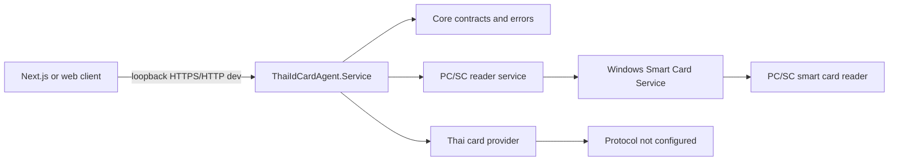

# ThaiIdCardAgent

ThaiIdCardAgent is a local Windows loopback agent for PC/SC smart card readers. It exposes an authenticated ASP.NET Core Minimal API for authorized web applications and keeps browser code away from USB/PCSC access.



## Current Status

Production Acceptance passed on the test machine with `ThaiIdCardAgent` installed as a Windows Service running under `NT AUTHORITY\LocalService`.

Validated through the installed service:

- HTTPS health on `https://localhost:18443` without certificate-validation bypass.
- JWT authentication and short-lived test JWT issue.
- Readers API.
- Card status API.
- Card ATR API.
- PC/SC access under `NT AUTHORITY\LocalService`.
- CardRemoved via status polling with 2 consecutive `NoCard` observations.
- CardInserted via status polling with 2 consecutive `CardPresent` observations.
- Restart service health/readers.
- Upgrade, uninstall while keeping config/logs, reinstall, and certificate retention.

Still not tested:

- SSE `CardRemoved` and `CardInserted` through `/api/v1/events`.
- Windows restart and Automatic Delayed Start after reboot.
- Code signing. Published binaries are currently unsigned.

Thai ID personal-data reading is not implemented. The agent has not read Citizen ID, name, address, birth date, or photo.

## Prerequisites

- Windows x64
- .NET SDK `10.0.302` or compatible .NET 10 SDK
- Windows Smart Card Service
- PC/SC-compatible smart card reader
- Administrator rights for service install/acceptance

## Build And Test

```powershell
dotnet clean -m:1 /nr:false
dotnet restore -m:1 /nr:false
dotnet build -c Release -m:1 /nr:false --no-restore
dotnet test -c Release -m:1 /nr:false --no-build --filter "Category!=Hardware"
```

## Run Console

```powershell
dotnet run --project ".\src\ThaiIdCardAgent.Console" -- readers
dotnet run --project ".\src\ThaiIdCardAgent.Console" -- status
dotnet run --project ".\src\ThaiIdCardAgent.Console" -- atr
dotnet run --project ".\src\ThaiIdCardAgent.Console" -- monitor
```

## Run Local API

Development HTTP is loopback-only on `http://127.0.0.1:18442`. Set the development key outside Git:

```powershell
$env:ASPNETCORE_ENVIRONMENT = "Development"
$env:Security__DevelopmentApiKey = "local-test-key"
dotnet run --project ".\src\ThaiIdCardAgent.Service"
```

Health is anonymous. Other endpoints require `X-Agent-Development-Key` in Development or a short-lived JWT in Production.

```powershell
Invoke-RestMethod -Uri "http://127.0.0.1:18442/api/v1/health"
Invoke-RestMethod -Uri "http://127.0.0.1:18442/api/v1/readers" -Headers @{ "X-Agent-Development-Key" = "local-test-key" }
```

Production binds HTTPS loopback on `https://localhost:18443`; HTTP is Development-only. Use `localhost` unless the certificate also contains IP SAN `127.0.0.1`.

Run production diagnostics without opening a listener:

```powershell
.\ThaiIdCardAgent.Service.exe --diagnostics
```

## Endpoints

- `GET /api/v1/health` anonymous health only, no reader/card data.
- `GET /api/v1/info` authenticated agent metadata.
- `GET /api/v1/readers` authenticated reader list.
- `GET /api/v1/card/status?readerName=...` authenticated current card status; auto-selects when one reader exists.
- `POST /api/v1/card/atr` authenticated ATR read.
- `POST /api/v1/card/read` authenticated, currently returns `THAI_CARD_PROTOCOL_NOT_CONFIGURED`.
- `GET /api/v1/events` authenticated Server-Sent Events for reader/card changes. SSE card-change acceptance is still not tested.

## Publish And Service Scripts

```powershell
.\scripts\Publish-WinX64.ps1
.\scripts\Install-Service.ps1 -WhatIf
.\scripts\Set-CertificatePrivateKeyAcl.ps1 -Thumbprint "<thumbprint>" -Account "NT AUTHORITY\LOCAL SERVICE" -WhatIf
.\scripts\Test-ProductionAcceptance.ps1 -WhatIf -CertificateThumbprint "<thumbprint>"
.\scripts\Uninstall-Service.ps1 -WhatIf
```

The install/uninstall scripts require Administrator rights. Do not store JWTs, private keys, PFX/P12 files, passwords, or cardholder data in Git or logs.

See `docs/PRODUCTION-SIMULATION.md`, `docs/PRODUCTION-READINESS.md`, and `docs/INSTALLATION.md` for the latest acceptance details and remaining items.