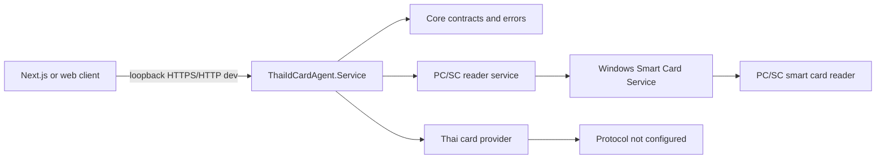

# ThaiIdCardAgent

ThaiIdCardAgent is a local Windows loopback agent for PC/SC smart card readers. It exposes an authenticated ASP.NET Core Minimal API for authorized web applications and keeps browser code away from USB/PCSC access.



## Prerequisites

- Windows x64
- .NET SDK `10.0.302` or compatible .NET 10 SDK
- Windows Smart Card Service
- PC/SC-compatible smart card reader

## Build And Test

```powershell
Get-Location
git status
dotnet clean
dotnet restore
dotnet build -c Release
dotnet test -c Release --filter "Category!=Hardware"
```

Inside the Codex managed sandbox, SDK 10.0.302 can fail solution-level `dotnet clean/build/test` in the parallel project graph with `0 Warning(s), 0 Error(s)`. The standard commands pass on the host outside that sandbox. See `docs/BUILD-TROUBLESHOOTING.md` before using `-m:1` as a workaround.

## Run Console

```powershell
dotnet run --project ".\src\ThaiIdCardAgent.Console" -- readers
dotnet run --project ".\src\ThaiIdCardAgent.Console" -- status
dotnet run --project ".\src\ThaiIdCardAgent.Console" -- atr
dotnet run --project ".\src\ThaiIdCardAgent.Console" -- monitor
```

## Run Local API

Development HTTP is loopback-only on `http://127.0.0.1:18442`. Set the development key outside Git:

```powershell
$env:ASPNETCORE_ENVIRONMENT = "Development"
$env:Security__DevelopmentApiKey = "local-test-key"
dotnet run --project ".\src\ThaiIdCardAgent.Service"
```

Health is anonymous. Other endpoints require `X-Agent-Development-Key` in Development or a short-lived JWT in Production.

```powershell
Invoke-RestMethod -Uri "http://127.0.0.1:18442/api/v1/health"
Invoke-RestMethod -Uri "http://127.0.0.1:18442/api/v1/readers" -Headers @{ "X-Agent-Development-Key" = "local-test-key" }
```

Production binds HTTPS loopback `https://localhost:18443`; HTTP is Development-only. Use `localhost` unless the certificate also contains IP SAN `127.0.0.1`.

Run production diagnostics without opening a listener:

```powershell
.\ThaiIdCardAgent.Service.exe --diagnostics
```

## Endpoints

- `GET /api/v1/health` anonymous health only, no reader/card data.
- `GET /api/v1/info` authenticated agent metadata.
- `GET /api/v1/readers` authenticated reader list.
- `GET /api/v1/card/status?readerName=...` authenticated card status; auto-selects when one reader exists.
- `POST /api/v1/card/atr` authenticated ATR read.
- `POST /api/v1/card/read` authenticated, currently returns `THAI_CARD_PROTOCOL_NOT_CONFIGURED`.
- `GET /api/v1/events` authenticated Server-Sent Events for reader/card changes.

## Publish And Service Scripts

```powershell
.\scripts\Publish-WinX64.ps1
.\scripts\Install-Service.ps1 -WhatIf
.\scripts\Set-CertificatePrivateKeyAcl.ps1 -Thumbprint "<thumbprint>" -Account "NT AUTHORITY\LOCAL SERVICE" -WhatIf
.\scripts\Uninstall-Service.ps1 -WhatIf
```

The install/uninstall scripts require Administrator rights. Do not install or alter the Windows Service without explicitly approving that action.

## Current Limits

- Thai ID card APDU/data reading is not implemented.
- The agent has not read Citizen ID, name, address, birth date, or photo.
- A verified Thai card protocol provider is still required before enabling personal-data reads.


See docs/PRODUCTION-SIMULATION.md for the Phase 8 controlled production simulation status and remaining no-go items.
