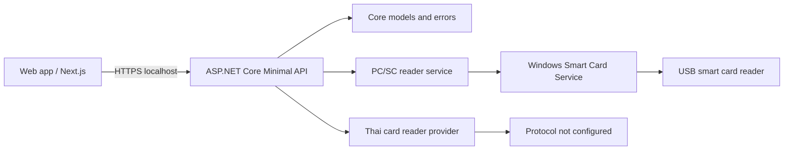

# ThaiIdCardAgent

ThaiIdCardAgent is a local Windows agent that exposes a loopback API for USB smart card readers through Windows PC/SC. Browser applications call the local API instead of accessing USB directly.



## Prerequisites

- Windows x64
- .NET SDK 10.0.302 or compatible .NET 10 SDK
- Windows Smart Card Service
- PC/SC-compatible smart card reader

## Quick Start

```powershell
dotnet restore "ThaiIdCardAgent.sln"
dotnet build "ThaiIdCardAgent.sln" -c Release
dotnet test "ThaiIdCardAgent.sln" -c Release --filter "Category!=Hardware"
dotnet run --project "src\ThaiIdCardAgent.Console\ThaiIdCardAgent.Console.csproj" -- readers
```

## Build

```powershell
dotnet build "ThaiIdCardAgent.sln" -c Release
```

## Test

```powershell
dotnet test "ThaiIdCardAgent.sln" -c Release --filter "Category!=Hardware"
dotnet test "ThaiIdCardAgent.sln" -c Release --filter "Category=Hardware"
```

Hardware tests require `THAI_ID_AGENT_HARDWARE_TESTS=1` and a real reader.

## Run Console

```powershell
dotnet run --project "src\ThaiIdCardAgent.Console\ThaiIdCardAgent.Console.csproj" -- diagnostics
dotnet run --project "src\ThaiIdCardAgent.Console\ThaiIdCardAgent.Console.csproj" -- readers
dotnet run --project "src\ThaiIdCardAgent.Console\ThaiIdCardAgent.Console.csproj" -- status --reader "Reader Name"
dotnet run --project "src\ThaiIdCardAgent.Console\ThaiIdCardAgent.Console.csproj" -- atr --reader "Reader Name"
dotnet run --project "src\ThaiIdCardAgent.Console\ThaiIdCardAgent.Console.csproj" -- monitor
```

## Run API

Development auth uses `X-Agent-Development-Key` from configuration, user secrets, or `THAI_ID_AGENT_DEV_KEY`.

```powershell
$env:THAI_ID_AGENT_DEV_KEY = 'change-me-outside-git'
dotnet run --project "src\ThaiIdCardAgent.Service\ThaiIdCardAgent.Service.csproj"
```

The service binds to loopback only. Production uses HTTPS `18443`. Development always enables HTTP `18442`; Development HTTPS `18443` can be enabled with `Agent:EnableHttpsInDevelopment=true` when a dev certificate exists.

## Publish

```powershell
.\scripts\Publish-WinX64.ps1
```

## Install

```powershell
.\scripts\Install-Service.ps1 -WhatIf
.\scripts\Install-Service.ps1
```

## Uninstall

```powershell
.\scripts\Uninstall-Service.ps1 -WhatIf
.\scripts\Uninstall-Service.ps1
```

## Known Limitations

- Thai ID card APDU protocol is not configured.
- Reader detection, card presence, and ATR are implemented, but this workspace has not been verified with real hardware.
- Production JWT validation currently supports a configured symmetric validation key for integration testing; production deployment should use a public verification key and keep signing outside the agent.

## Thai Card Protocol Status

`POST /api/v1/card/read` returns HTTP 501 with `THAI_CARD_PROTOCOL_NOT_CONFIGURED` until a verified Thai ID card protocol provider is supplied.