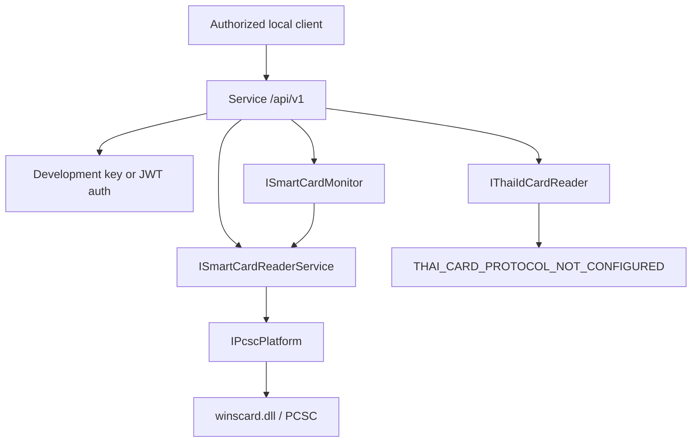

# Architecture

ThaiIdCardAgent is split into small projects:

- `ThaiIdCardAgent.Core`: contracts, result/error models, privacy helpers, and exceptions.
- `ThaiIdCardAgent.Pcsc`: Windows PC/SC integration, reader state mapping, ATR formatting, and polling monitor.
- `ThaiIdCardAgent.ThaiCard`: Thai ID card reader abstraction. The current provider is intentionally not configured.
- `ThaiIdCardAgent.Service`: ASP.NET Core Minimal API and Windows Service host.
- `ThaiIdCardAgent.Console`: diagnostics and hardware verification commands.

The Service project uses dependency injection for `ISmartCardReaderService`, `ISmartCardMonitor`, and `IThaiIdCardReader`. Endpoints must not call PC/SC APIs directly.

Reader availability is independent from card connection. PC/SC states are flags and are mapped with bitwise checks in `PcscStateMapper`.
