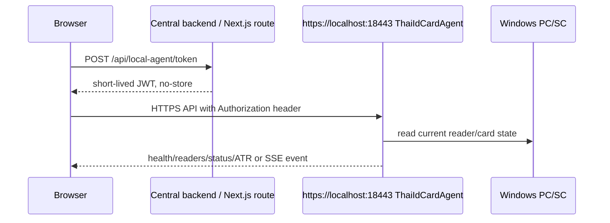

# Web Integration

ThaiIdCardAgent is designed for this production flow:



The private signing key stays server-side. Browser code never receives the private key and never stores JWTs in `localStorage`, `sessionStorage`, URLs, or logs. Because the Agent has replay protection on `jti`, the browser example requests a fresh JWT for every protected API request and for every SSE connection or reconnect.

## Contracts Used

The example uses the current Agent contract:

- Base URL: `https://localhost:18443` in Production.
- Anonymous endpoint: `GET /api/v1/health`.
- Authenticated endpoints: `GET /api/v1/readers`, `GET /api/v1/card/status`, `POST /api/v1/card/atr`, `GET /api/v1/events`.
- JWT issuer: `thai-id-card-agent-client`.
- JWT audience: `thai-id-card-agent`.
- Required claims: `jti`, `sub`, `workstation_id`.
- Maximum JWT lifetime: 60 seconds.
- Error response shape: `success`, `data`, `error.code`, `error.message`, `requestId`.
- SSE payload shape: `eventType`, `readerName`, `cardPresent`, `atr`, `occurredAtUtc`.

`POST /api/v1/card/read` is intentionally not used by the browser flow. It currently returns HTTP 501 `THAI_CARD_PROTOCOL_NOT_CONFIGURED` until a verified Thai card protocol provider is implemented.

## Next.js Example

The runnable example is in `examples/nextjs-client`.

```powershell
cd "D:\1.FrontEnd Framework\ThaiIdCardAgent\examples\nextjs-client"
npm ci
copy .env.example .env.local
npm run dev
```

Configure `.env.local` with placeholders replaced on the server side only:

```text
NEXT_PUBLIC_THAI_ID_AGENT_BASE_URL=https://localhost:18443
THAI_ID_AGENT_JWT_PRIVATE_KEY_PATH=<PATH-TO-SERVER-SIDE-TEST-PRIVATE-KEY-PEM>
THAI_ID_AGENT_JWT_ISSUER=thai-id-card-agent-client
THAI_ID_AGENT_JWT_AUDIENCE=thai-id-card-agent
THAI_ID_AGENT_JWT_SUBJECT=nextjs-client
THAI_ID_AGENT_WORKSTATION_ID=localhost-pilot
THAI_ID_AGENT_JWT_TTL_SECONDS=60
```

Do not prefix private-key settings with `NEXT_PUBLIC_`. Do not commit `.env.local`, private keys, JWTs, PFX/P12 files, certificate passwords, or cardholder data.

## Browser SSE

The browser uses `fetch` streaming instead of `EventSource` because `EventSource` cannot send an `Authorization` header. The SSE client parses `event`, `data`, `id`, and multiline `data` fields, validates the ReaderEvent schema, aborts the stream on disconnect, and reconnects with bounded exponential backoff. Every reconnect asks the token broker for a fresh JWT.

Status polling is not counted as SSE success. SSE success requires receiving `CardRemoved` and `CardInserted` through `GET /api/v1/events`.

## CORS

The Agent only allows exact configured origins. Wildcards, reflected origins, and `AllowAnyOrigin` are not allowed. For a pilot Next.js app running on `http://localhost:3000`, configure that exact origin in the Agent environment or appsettings used by the installed service.

## Browser Troubleshooting

- Agent unavailable: check `Get-Service ThaiIdCardAgent` and confirm `https://localhost:18443/api/v1/health` returns HTTP 200.
- Certificate trust failed: install the public localhost certificate into the correct machine trust scope. Do not use `-k`, `--insecure`, or browser certificate bypass for acceptance.
- 401 or replay: issue a fresh JWT for the request; do not reuse tokens.
- 422 `CARD_NOT_PRESENT`: insert the card and retry status/ATR.
- 501 `THAI_CARD_PROTOCOL_NOT_CONFIGURED`: Thai card data reading is not configured; this is expected for `/api/v1/card/read`.
